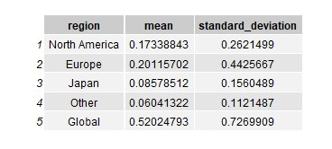
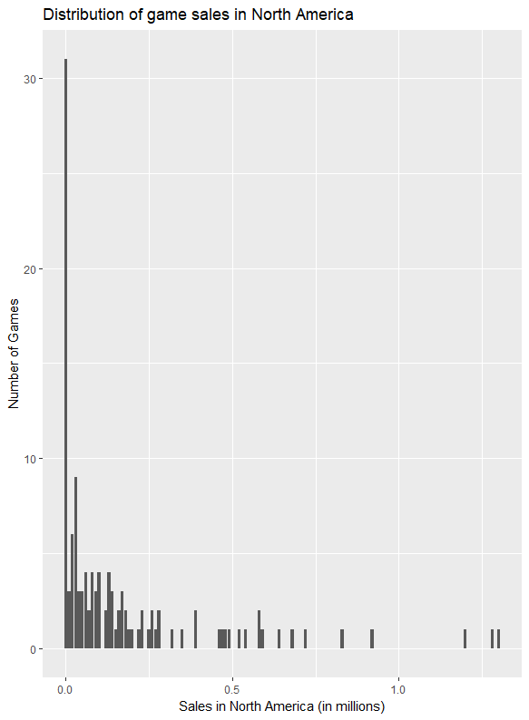
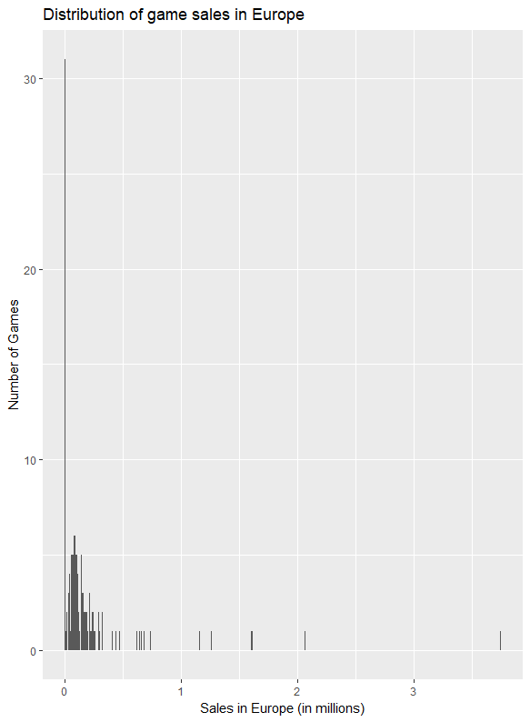
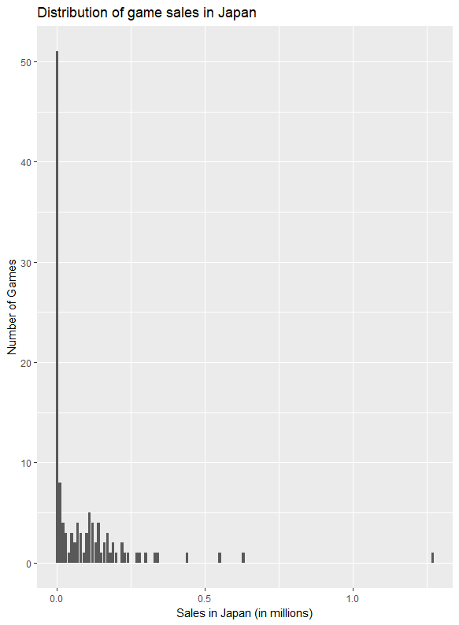

Keri Mallari  
Fall 2018 Project

Data: Video Game Sales  
Source: https://www.kaggle.com/gregorut/videogamesales  

The data consists a list of videogames with sales greater than 100,000 copies. The kaggle contributor scraped this data using BeautifulSoup on Python at vgchartz.com. The data contain 11 features ranging from various sales numbers in North America, Europe, and Japan - since Japan as a country is a big publisher and consumer of videogames. There are also information on the platform and genre of the game. 

Questions: 
1. How much does Japan control the video game industry?
2. Does decrease in sale impact the number of games a publisher will release?
3. Is the publisher of the game indicative of the game genre and platform? 

Mean and Standard Deviation of Video Game Sales based on their region.

Distribution of sales in North America, Europe, and Japan

 |  | 
