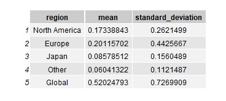
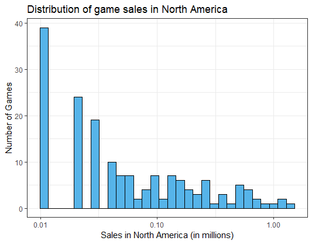
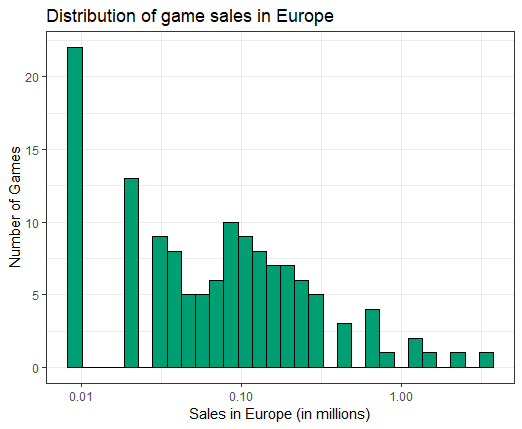
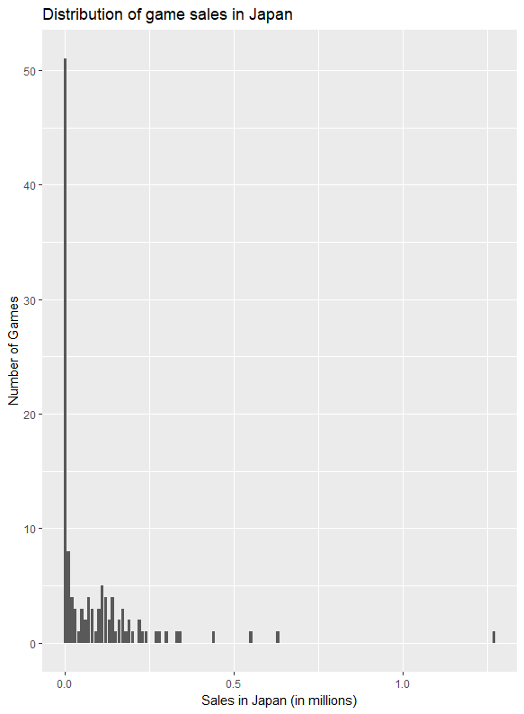
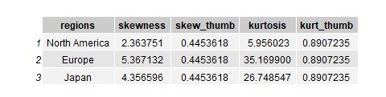
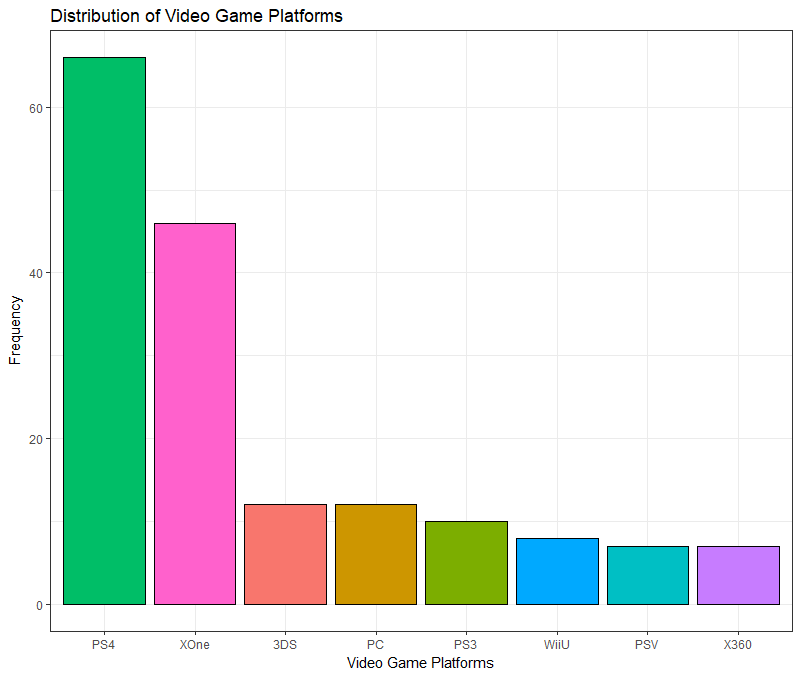
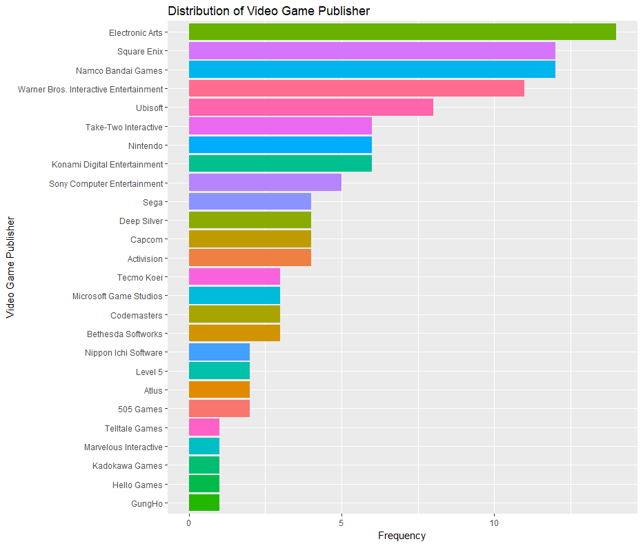

Keri Mallari  
Fall 2018 Project

Data: Video Game Sales  
Source: https://www.kaggle.com/gregorut/videogamesales  

The data consists a list of videogames with sales greater than 100,000 copies. The kaggle contributor scraped this data using BeautifulSoup on Python at vgchartz.com. The data contain 11 features ranging from various sales numbers in North America, Europe, and Japan - since Japan as a country is a big publisher and consumer of videogames. There are also information on the platform and genre of the game. 

Questions: 
1. How much does Japan control the video game industry?
2. Does decrease in sale impact the number of games a publisher will release?
3. Is the publisher of the game indicative of the game genre and platform? 

Mean and Standard Deviation of Video Game Sales based on their region.  

Distribution of sales in North America, Europe, and Japan

 

 

To better understand the shape of these plots, the dataframe below lists the value of kurtosis and skewness, as well the the value of 2sqrt(6/n) and 4sqrt(6/n) to verify the skewness and kurtosis.  

The rule of thumb for skewness states that if the value of skewness is greater than 2sqrt(6/n) then that graph is significantly skewed towards the direction of the sign. Since the table above shows that all values of skewness are greater than the rule of thumb value, the three distributions are positively skewed, which is evident in the plots as well. Similarly, the rule of thumb for kurtosis states that if the absolute value of the kurtosis is greater than 4sqrt(6/n) then the it is significantly greater than 0. Since the table above shows that all values of kurtosis are greater than the rule of thumb value, the three distributions are leptokurtic - which means that there is a steep peak and heavy tails, both evident in all plots.

Looking at the distribution of the qualitative columns in our dataset: platforms, publishers, and genre

 

We see that PS4 is a very popular platform for purchasing videogames. This surprises me as I assume that there are more people playing on their PCs, until I realized that we are looking at video game sales and not player base in general, which makes sense because a lot of popular pc games are free such as League of Legends and Fortnite, as opposed to PS4 games. Action games are most popular video game genre. I flipped the graph for the video game publisher since it would be easier to read the x-values (publishers). 
