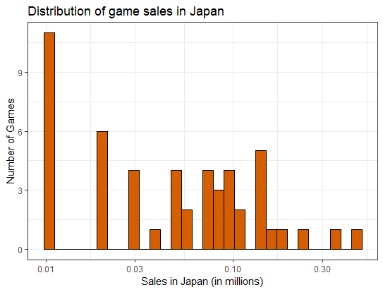
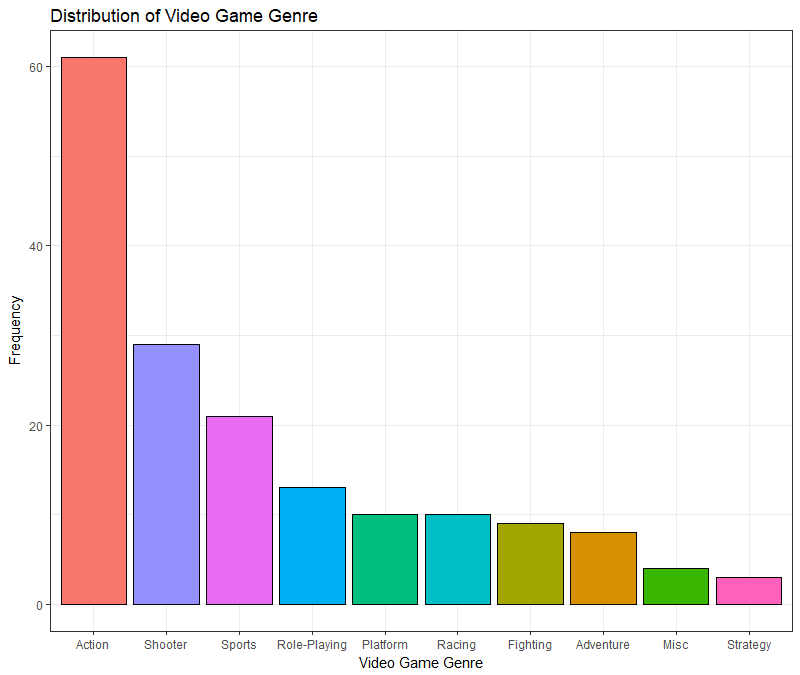
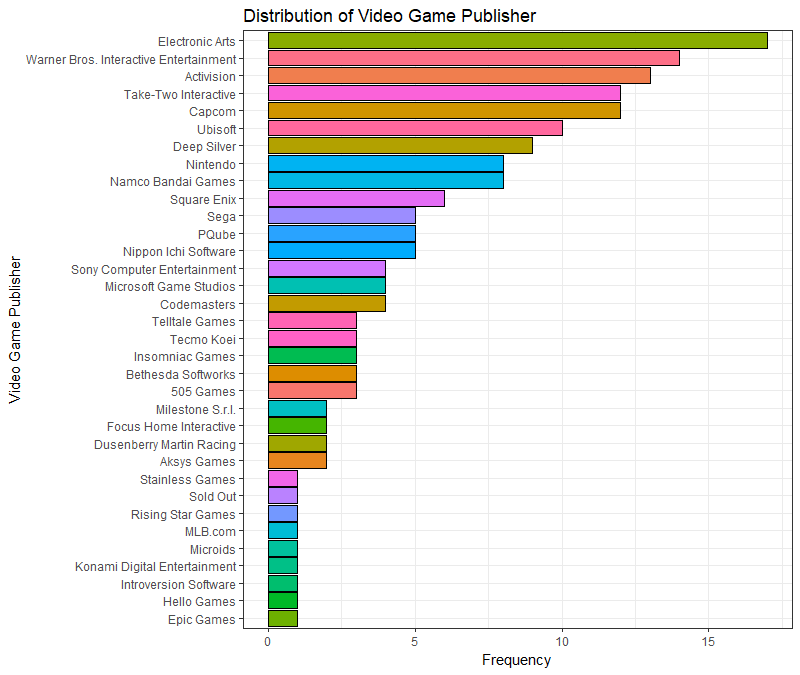
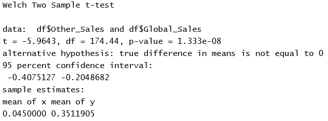

Keri M  
Fall 2018 Project

Data: Video Game Sales  
Source: https://www.kaggle.com/gregorut/videogamesales  

The data consists a list of videogames with sales greater than 100,000 copies. The kaggle contributor scraped this data using BeautifulSoup on Python at vgchartz.com. The data contain 11 features ranging from various sales numbers in North America, Europe, and Japan - since Japan as a country is a big publisher and consumer of videogames. There are also information on the platform and genre of the game. 

Questions: 
1. How much does Japan control the video game industry?
2. Does decrease in sale impact the number of games a publisher will release?
3. Is the publisher of the game indicative of the game genre and platform? 

***

Mean and Standard Deviation of Video Game Sales based on their region.  

Distribution of sales in North America, Europe, and Japan.
These graphs are scaled by log 10 because it is right skewed. The scale allows us to better see and understand the distribution.

 

 

To better understand the shape of these plots, the dataframe below lists the value of kurtosis and skewness, as well the the value of 2sqrt(6/n) and 4sqrt(6/n) to verify the skewness and kurtosis.  

The rule of thumb for skewness states that if the value of skewness is greater than 2sqrt(6/n) then that graph is significantly skewed towards the direction of the sign. Since the table above shows that all values of skewness are greater than the rule of thumb value, the three distributions are positively skewed, which is evident in the plots as well. Similarly, the rule of thumb for kurtosis states that if the absolute value of the kurtosis is greater than 4sqrt(6/n) then the it is significantly greater than 0. Since the table above shows that all values of kurtosis are greater than the rule of thumb value, the three distributions are leptokurtic - which means that there is a steep peak and heavy tails, both evident in all plots.

***
Looking at the distribution of the qualitative columns in our dataset: platforms, publishers, and genre

 

We see that PS4 is a very popular platform for purchasing videogames. This surprises me as I assume that there are more people playing on their PCs, until I realized that we are looking at video game sales and not player base in general, which makes sense because a lot of popular pc games are free such as League of Legends and Fortnite, as opposed to PS4 games. Action games are most popular video game genre. I flipped the graph for the video game publisher since it would be easier to read the x-
values (publishers). 

***

In calculating the confidence intervals for our three numerical column, I generated a sample of size 30 for each column. Then recalculated the sample mean, sample standard deviation, and sample standard error. With size 30, I will use the Central Limit Theorem. I selected 95% confidence level.

The table below shows the sample mean, sample standard deviation, sample error, and the left and right confidence intervals. 

***

Hypotheses Testing

For the purpose of this project, I will be using the average global sales as the 'ground truth' and run 4 hypothesis tests where I am comparing the average sales of NA against Global, EU against Global, JP against Global, and Other against Global Sales. The alpha for the t-test is 0.05 so the confidence level generated is 95%.

There are four different hypothesis to consider:

|   | Null Hypothesis            | Alternate Hypothesis        |  
| - | -------------------------- | --------------------------- |
| 1 | NA_Sales = Global_Sales    | NA_Sales != Global_Sales    |
| 2 | EU_Sales = Global_Sales    | EU_Sales != Global_Sales    |
| 3 | Japan_Sales = Global_Sales | Japan_Sales != Global_Sales |
| 4 | Other_Sales = Global_Sales | Other_Sales != Global_Sales |

Below is the table of the results of the function t-test. 

| Regions | North America vs Global Sales | Europe vs Global Sales |
| ------- | ----------------------------- | ---------------------- |
| T-test  |           |    |

| Regions | Japan vs Global Sales | Other vs Global Sales |
| ------- | --------------------- | --------------------- |
| T-test  |   |   |

After conducting the t-test on all these pairs of means, I found that we can reject the null ypothesis for all four different scenarios because the test statistic is less than the critical value. 

***

ANOVA of average video game sales in North America grouped by top 3 video game platforms

Below is the plot of the sales of video games in North America grouped by their platforms: 3DS, PS4, and Xbox One. These three platforms are the most popular platforms in terms of sales. I conducted an analysis of variance of sales in north america grouped by the top 3 platforms. 

Null Hypothesis: The average sales of each platform are all equal.
Alternate Hypothesis: At least one of the platform's average sales is significantly different from the rest.

Below is the ANOVA table, which tells us that we CANNOT reject the null hypothesis.

|           | degrees of freedom | sum squared | mean squared | F-Value | Pr(>F) |
| --------- | ------------------ | ----------- | ------------ | ------- | ------ |
| Platform  |                  2 |       0.133 |      0.06633 |   0.997 |  0.372 |
| Residuals |                121 |       8.049 |      0.06652 |         |        |    

Below are the boxplots of sales of each platform, and the plot of the Tukey's Significant Different Test.
|  |  |

***

ANOVA of average video game sales in North America grouped by top 3 video game genres

Below is the plot of the sales of video games in North America grouped by their platforms: Action, Shooter, and Sports. These three platforms are the most popular platforms in terms of sales. I conducted an analysis of variance of sales in north america grouped by the top 3 platforms. 

Null Hypothesis: The average sales of each genre are all equal.
Alternate Hypothesis: At least one of the genre's average sales is significantly different from the rest. 

Below is the ANOVA table, which tells us that we CANNOT reject the null hypothesis. 

|           | degrees of freedom | sum squared | mean squared | F-Value | Pr(>F) |
| --------- | ------------------ | ----------- | ------------ | ------- | ------ |
| Platform  |                  2 |       0.588 |       0.2940 |   4.382 | 0.0148 |
| Residuals |                108 |       7.246 |       0.0671 |         |        |    

Below are the boxplots of sales of the three genres, and the plot of Tukey's Significant Difference Test. 
|  |  |
